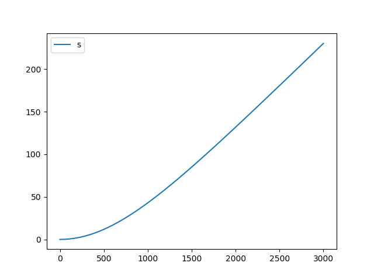

# Modeling with Python
This module enables you to quickly model physics and other subjects using basic building blocks. These are:
- `Variable`
- `Constant`
- `Stream`

Let's consider the following example: Imagine a car which starts with a veolcity of zero and then gradually accelerates. While it accelerates, it burns fuel and it has an increased air resistance. Of course there are other factors, but this model would be implemented like this:
```python
from model import Model, Stream, Variable, Constant

# Define model
model = Model("Car", 300) # 300 seconds of modeling

# Constants
Froll = Constant("Froll", "N", 1000) # Roll resistance
k = Constant("k", "", 10) # Air resistance coefficient
m_base = Constant("m_base", "kg", 1000) # Base mass
rch = Constant("rch", "J/kg", 46e6) # Combustion energy density
Fm = Constant("Fm", "N", 1010) # Motor force

# Variables

s = Variable("s", "m") # Distance
v = Variable("v", "m/s") # Velocity
a = Variable("a", "m/s^2") # Acceleration
a.define("Fnetto/m")

Pm = Variable("Pm", "J/s")
Pm.define("Fnetto*v")

m_fuel = Variable("m_fuel", "kg", 10) # Fuel mass

m = Variable("m", "kg", m_base.value + m_fuel.value)
m.define("m_base+m_fuel")

Flw = Variable("Flw", "N")
Flw.define("k*v**2")

Fnetto = Variable("Fnetto", "N") # Netto force
Fnetto.define("Fm-Froll-Flw")

# Connections
s < Stream("v*dt") # Distance increases with speed
v < Stream("a*dt") # Velocity increases with acceleration
m_fuel > Stream("Pm*dt/rch") # Fuel decreases with motor power

# Start model
model.add_scope(locals())
model.add_stop("m_fuel <= 0")
model.loop(True)

# Show results

model.plot("s")
model.show()
```
This model can be found in `Car.py`. It yields the following plot of the distance:

